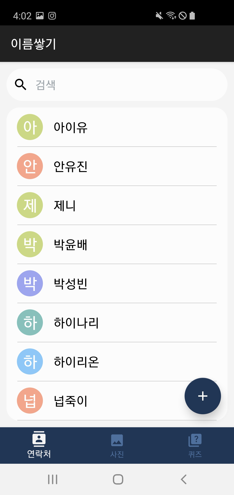

# Week 1 - 이름 쌓기

<aside>
💡 어플 다운로드 링크 : [https://drive.google.com/file/d/1l8UCuSh1TULLHtMRZvony6FabsSw0hh_/view?usp=sharing](https://drive.google.com/file/d/1l8UCuSh1TULLHtMRZvony6FabsSw0hh_/view?usp=sharing)

</aside>

<aside>
💡 Github : [https://github.com/parkyounbae/madcamp_week1](https://github.com/parkyounbae/madcamp_week1)

</aside>

# Project : 이름 쌓기

# 팀원 - 박성빈, 박윤배

# Project 설명

몰입캠프 오셔서 사람 얼굴 외우기 힘드셨죠? 🥲 저희 이름쌓기에는 연락처, 사람의 프로필 이미지를 통한 이름학습 게임이 탑재되어 있습니다! 저희 어플을 사용하셔서 모두의 이름을 빠르게 습득하세요~!

# 사용법

### Tab1 : 연락처

1. 연락처 보기 & 검색 기능
    
    기본적으로 목록에는 사람들의 이름만 보이게 하였습니다. 미적 요소를 위해 이름 앞에 랜덤으로 색상이 지정되는 원형의 이미지를 배치하였습니다. 이때 사람의 연락처 목록을 클릭한다면 세부사항을 표시하는 페이지로 넘어가게 됩니다. 
    

1. 세부사항 페이지
    
    연락처 페이지에서 목록을 클릭하면 세부사항 페이지로 넘어가게 됩니다. 상단에 이름과 사진이 표시되고 세부사항으로는 번호, 이메일, 인스타그램이 표시됩니다.
    
     이때 번호를 클릭하게 되면 기본 다이얼 어플로 화면이 넘어가고 번호가 복사됩니다. 이메일을 클릭하면 기본 이메일 어플로 넘어가게 되고 받는사람의 탭에 이메일이 입력되게 됩니다. 마지막으로 인스타그램을 탭하면 인스타그램 어플로 화면이 넘어가게 되고 해당 프로필 페이지로 이동합니다. 
    

1. 수정/삭제/추가
    
    상세 페이지에서는 해당 프로필의 수정이 가능합니다. 프로필 이미지는 카메라로 찍거나 갤러리에서 선택할 수 있고 그 외의 정보들도 수정 가능합니다. 이때 이름과 전화번호의 경우 올바르지 않은 형식이나 입력되지 않았다면 확인버튼을 누를수 없도록 하였습니다. 수정 이후에 리스트, 갤러리, 퀴즈 탭에 모두 반영되도록 하였습니다.  
    

기존의 프로필

이름과 사진 수정

수정된 사항이 반영됨

상세페이지에서 삭제버튼을 누르면 확인 알림이 출력되고 확인 버튼을 누르면 해당 연락처가 삭제됩니다. 이 또한 모든 탭의 정보에 반영됩니다. 

마지막으로 메인 리스트에 있는 + 플로팅 버튼을 누르면 추가 회면으로 넘어가고 새롭게 연락처를 추가할 수 있습니다. 이 또한 모든 탭에 반영됩니다. 

### Tab2: 갤러리

GridView를 통해 사람들의 사진을 볼 수 있고, 터치 시 저장한 연락처의 프로필 사진을 CustomDialog로 더 크게 조회할 수 있도록 하였습니다.

“OK” 버튼, 뒤로가기 버튼, 또는 Dialog 밖의 화면을 터치하면 Dialog가 사라지며 본 갤러리 Fragment로 돌아옵니다.

Tab 1 (연락처 탭)에서 연락처 정보나 이미지를 수정했을 시, 갤러리 탭에도 수정 사항이 반영됩니다.

### Tab3: 퀴즈

1. 시작 페이지
    
    시작 버튼을 눌러 QuizActivity로 넘어갈 수 있게 하였습니다.
    
2. 퀴즈 메인 화면
    
    저장된 사람들의 연락처 정보를 불러온 뒤, 이름을 입력하여 맞추는 게임 형식의 퀴즈를 제작하였습니다.
    
    연락처 탭에 저장된 순서대로 프로필 사진이 화면에 보여집니다. 사진에 해당하는 사람의 이름을 입력창에 입력하고 “제출하기” 버튼을 눌러 정답 여부를 확인합니다. 정답일 경우 Toast로 “정답입니다!” 알림이, 오답일 경우 오답 알림이 뜨도록 하였습니다.
    
    실시간으로 맞힌 개수와 퀴즈 시작을 기점으로 소요된 시간이 Stopwatch로 보여지며, “포기하기” 버튼을 누를 경우, 즉시 퀴즈를 종료하고 ResultActivity가 실행될 수 있도록 하였습니다.
    

1. 퀴즈 종료 화면
    
    퀴즈 메인 화면에서 모든 문제를 풀었거나 “포기하기” 버튼을 눌렀을 때, 퀴즈 종료 화면으로 넘어오며 ResultActivity가 실행됩니다.
    
    퀴즈 종료 화면에서는 최종적으로 맞힌 문제 개수, 퀴즈 시작부터 종료까지 걸린 시간, 그리고 퀴즈 종료를 축하하는 컨페티 효과가 보입니다.
    
    또한, 점수 구간에 따라, 화면 중앙에 각기 다른 메시지가 보여집니다.
    
    해당 화면에서 “종료하기” 버튼을 누르면 ResultActivity가 종료되며, NaviActivity로 이동합니다.
    

